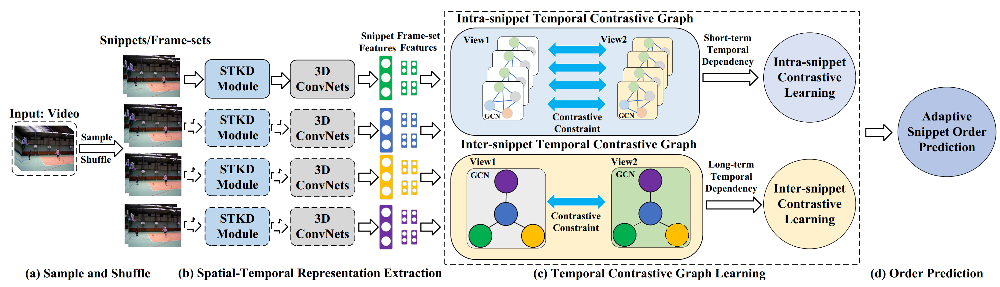

## [TCGL: Temporal Contrastive Graph for Self-spervised Video Representation Learning](https://arxiv.org/abs/2112.03587)
IEEE Transactions on Image Processing 2022

<a href="https://orcid.org/0000-0002-9423-9252" target="orcid.widget" rel="noopener noreferrer" style="vertical-align:top;">orcid.org/0000-0002-9423-9252</a>

Homepage: [https://yangliu9208.github.io/home/](https://yangliu9208.github.io)

## Abstract
Attempt to fully discover the temporal diversity for self-supervised video representation learning, this work takes advantage of the temporal dependencies within videos and further proposes a novel self-supervised method named Temporal Contrastive Graph Learning (TCGL). In contrast to the existing methods that consider the temporal dependency from a single scale, our TCGL roots in a hybrid graph contrastive learning strategy to jointly regard the inter-snippet and intra-snippet temporal dependencies as self-supervision signals for temporal representation learning. To learn multi-scale temporal dependencies, the TCGL integrates the prior knowledge about the frame and snippet orders into graph structures, i.e., the intra-/inter- snippet temporal contrastive graph modules. By randomly removing edges and masking node features of the intra-snippet graphs or inter-snippet graphs, the TCGL can generate different correlated graph views. Then, specific contrastive learning modules are designed to maximize the agreement  between nodes in different views. To learn the global context representation and recalibrate the channel-wise features adaptively, we introduce an adaptive video snippet order prediction module, which leverages the relational knowledge among video snippets to predict the actual snippet orders. Experimental results demonstrate the superiority of our TCGL over the state-of-the-art methods on large-scale action recognition and video retrieval benchmarks.

## Model

Figure 1: Framework of our proposed TCGL. 

## Codes 
The codes are available now!    

Action Recognition Usage:
For example, pretrain R3D backbone on UCF101, fintune on UCF101 for action recognition:
1. Run 1_train_TCGL_UCF101_R3D.py to obtain the pretrained model.
2. Run 2_ft_tcg_classify.py to finetune the pretrained model on UCF101.
3. Run 3_train_classify.py to load the finetuned model to conduct action recognition.

Video Retrieval Usage:
For example, pretrain R3D backbone on UCF101, evaluate video retrieval on UCF101:
1. Run 1_train_TCGL_UCF101_R3D.py to obtain the pretrained model.
2. Run 4_retrieve_clips.py to load the pretrained model to conduct video retrieval.

```
@article{tcgl,
  author={Liu, Yang and Wang, Keze and Liu, Lingbo and Lan, Haoyuan and Lin, Liang},
  journal={IEEE Transactions on Image Processing}, 
  title={TCGL: Temporal Contrastive Graph for Self-Supervised Video Representation Learning}, 
  year={2022},
  volume={31},
  number={},
  pages={1978-1993},
  doi={10.1109/TIP.2022.3147032}
}
``` 
If you have any question about this code, feel free to reach me (liuy856@mail.sysu.edu.cn) 
